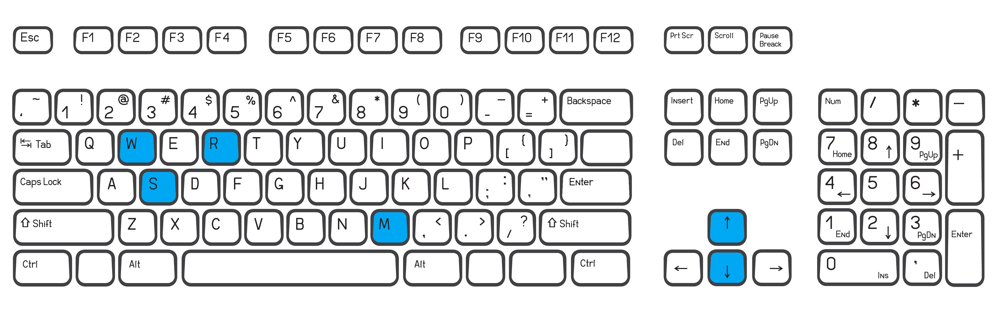

# Oppy's Demise

(Ironhack project - module 1)


Click [HERE](https://farneze.github.io/Oppys_Demise/) to play **Oppy's Demise**

---

## Introduction

Opportunity, nicknamed "Oppy", was launched on July 7, 2003, as part of NASA's Mars Exploration Rover program, it landed on Mars on January 25, 2004.

With a mission planned duration of 92.5 Earth days, Oppy exceeded its operating plan by 55 times its designed lifespan, meaning 14 years and 46 days (in Earth time).

Due to the planetary dust storm on Mars, Oppy ceased communications on June 10, 2018, and entered hibernation two days later.

On February 13, 2019, NASA officials declared that the Opportunity mission was complete, after the spacecraft had failed to wake up to over 1,000 calls sent from earth since August 2018.

This is its final moments before the storm...

---

## Movement Controls

- W, :arrow_up: : Move up
- S, :arrow_down: : Move down
- R: Reset game status
- M: Mute game music



---

## Features

- Has drama, action, a mission, hope...
- **Based** on real life events
- It's hard
- Customized backgrounds
- **Easter Eggs**!
- Custom function for debuging, so you can **debug more** while **writing less**!!

  ```js
  function con(consoleMsg) {
    console.log(consoleMsg);
  }
  ```

!! Warning !!

```
  Whenever an error appears for a command inside **con()**,
  the console will reference is to the function, not to the
  line it was called.
```

## 

## The Game


#### The Mechanics

- Dodge **obstacles** to avoid being dragged inside the **light storm** or the **heavy storm**
- If you are dragged by rock, again, try to **dodge** it and the rover will **speed up** to reach its starting position
- Staying inside the **light storm** makes it **difficult to see** where the rover is, while it also **drains the battery**. _No **sun**, no **battery**._
- Touch **heavy storm** and it's game over. _No **light storm**, no **chance**._

#### The HUD - Heads Up Displayd

- **Alive**:
  - Shows for how long you are "living"
- **Battery**:
  - Shows how long you can stay inside the light storm
  - Recharges slower than it takes to discharge
  - Recharges if you stay out of it
- **Status**:
  - Shows if it is charging, discharging or full
- **Alert**:
  - Informs whenever game speed gets faster
- **Game speed**:
  - Shows how much is impossible to reach "Game speed: 10"

---

Radio signals are fading...
